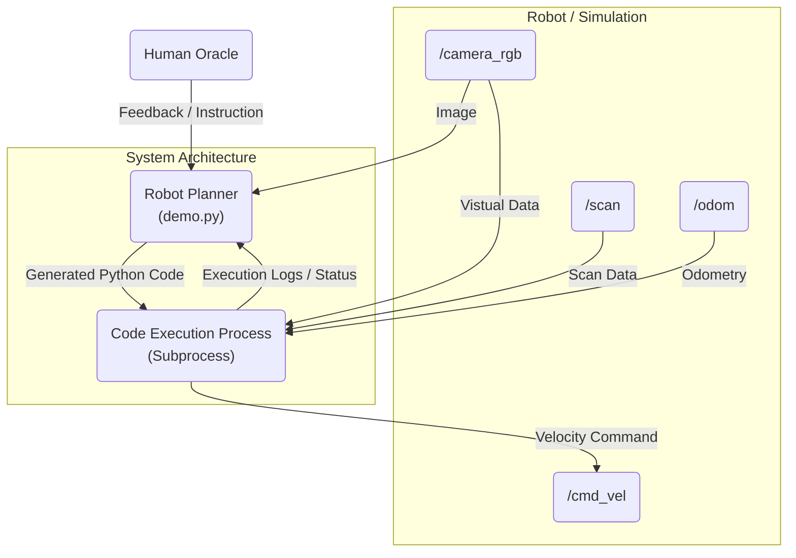

# Langsim: Final Writeup

## Project Description

Langsim is a human-VLM (Vision-Language Model) collaboration framework designed to enable natural language planning for ROS 2 robots. The goal of this project is to lower the barrier for human-robot interaction by allowing users to control a robot, such as a TurtleBot 4, using natural language or voice commands. This project is particularly interesting because it leverages the code generation and transformation capabilities of Multimodal LLMs to analyze visual and text inputs and dynamically plan tasks, rather than relying on static action primitives.

We finetune a Qwen3-VL-8B model (model checkpoints available on [HuggingFace](https://huggingface.co/DotIN13/qwen3-vl-robot-planner)) as a robot planner that can interpret a high-level command like *"Find and move to the blue cylinder."* If the robot fails (e.g., returns `TASK_RESULT:FAIL`), the framework supports human-in-the-loop guidance. A user can provide a corrective prompt, such as *"If you move to the pink cylinder first... you should be able to find and reach the blue cylinder,"* which allows the robot planner to update its plan, rewrite the code and recover.

### Main Components

* **Human Supervisor (Oracle):** Provides natural language guidance, queries, and ground truth information (e.g., map, target).
* **VLM-Based Planner Agent:** Acts as the reasoning layer. It decides whether to "Ask" for help or "Code" a solution. It integrates visual perception (egocentric RGB images) and robot state to generate Python code.
* **ROS 2 Execution Environment:** The generated code is executed on the robot (TurtleBot 4), sending commands to topics like `/cmd_vel`.
* **Simulation & Offline Learning:** NVIDIA Isaac Sim and Replicator were used to generate synthetic datasets of Python scripts to fine-tune the model for spatial reasoning and interactiveness.


Finding the cylinder behind the wall (second round, after human feedback, GPT-4o)

## Research Gap

Recent research in robot planning has shifted from static primitives to dynamic code generation (Liang et al., 2023) and end-to-end Vision-Language-Action (VLA) models (Zitkovich et al., 2023). While code generation offers interpretability, early approaches lacked direct visual grounding, often relying heavily on text-only prompts. Conversely, monolithic VLAs integrate vision but suffer from high inference latency and "black-box" opacity. Furthermore, while agents like *Voyager* demonstrated that iterative code refinement works in gaming environments (Wang et al., 2023), and frameworks like *KnowNo* enabled robots to ask for help before acting (Ren et al., 2024), there remains a gap in effectively using human feedback to correct physical navigation failures in real-time. Although recent work like *RoboCodeX* has begun to explore multimodal code generation (Mu et al., 2024), significant challenges remain in efficient human collaboration.

Langsim addresses these limitations by proposing a modular human-VLM collaboration framework for ROS 2. Unlike the text-only limitations of Liang et al. (2023) or the heavy computational cost of Zitkovich et al. (2023), we fine-tune a lightweight VLM to generate Python code with access to egocentric vision and human feedback. Our primary contribution is a robust **human-in-the-loop correction mechanism**: rather than just asking for help *before* a task based on external probabilities, Langsim uses multi-turn interactions data to help planner agents learn to ask for help when it is needed, which the agent then uses to dynamically rewrite its code and recover. The research opens up new possibilities for efficient human-robot collaboration, and calls for future work in multi-agent robot planning frameworks.

### References

Liang, J., Huang, W., Xia, F., Xu, P., Hausman, K., Ichter, B., ... & Zeng, A. (2022). Code as policies: Language model programs for embodied control. arXiv preprint arXiv:2209.07753.

Mu, Y., Chen, J., Zhang, Q., Chen, S., Yu, Q., Ge, C., ... & Luo, P. (2024). Robocodex: Multimodal code generation for robotic behavior synthesis. arXiv preprint arXiv:2402.16117.

Ren, A. Z., Dixit, A., Bodrova, A., Singh, S., Tu, S., Brown, N., ... & Majumdar, A. (2023). Robots that ask for help: Uncertainty alignment for large language model planners. arXiv preprint arXiv:2307.01928.

Wang, G., Xie, Y., Jiang, Y., Mandlekar, A., Xiao, C., Zhu, Y., ... & Anandkumar, A. (2023). Voyager: An open-ended embodied agent with large language models. arXiv preprint arXiv:2305.16291.

Zitkovich, B., Yu, T., Xu, S., Xu, P., Xiao, T., Xia, F., ... & Han, K. (2023, December). Rt-2: Vision-language-action models transfer web knowledge to robotic control. In Conference on Robot Learning (pp. 2165-2183). PMLR.

## System Architecture

We implemented a complete pipeline for training and deploying a VLM-based robot planner. The architecture consists of four major components:

1.  **Online Data Generation with Simulation**
    *   **Code**: `online/sim.py`, `online/planner.py`, `gen.py`
    *   **Algorithm**: We leverage [NVIDIA Isaac Sim](https://developer.nvidia.com/isaac/sim) and `omni.replicator` to procedurally generate training environments. 
        *   `gen.py`: Only handles the *static scene generation*, spawning scenes with randomized robot poses and obstacles (cylinders of diverse colors) and validating them. The current implementation is limited to the `simple_room` scene, but it has the potential to be extended to more complex environments such as the [Interior Agent Dataset](https://huggingface.co/datasets/spatialverse/InteriorAgent).
        *   `online/sim.py`: Starts the Isaac Sim application and loads the generated USD stages.
        *   `online/planner.py`: Spins up the LLM agents to randomly pick a cylinder target, guides the robot to the goal, and logs the dialogue and actions as training data. This node also manages simulation state (scene loading and resets) via the [Isaac Sim ROS 2 Simulation Control Extension](https://docs.isaacsim.omniverse.nvidia.com/5.1.0/ros2_tutorials/tutorial_ros2_simulation_control.html).

2.  **Offline Data Generation & Validation**
    *   **Code**: `offline/`
    *   **Algorithm**: To scale up training, we also deploy code generation for a couple simple tasks such as spin in circles, move towards the wall, follow the person to generate a large dataset of valid navigation scenarios, having the assumption that large models can do these well enough so that we do not need to validate them in simulation before using them for training.

3.  **QLoRA VLM SFT Fine-tuning**
    *   **Code**: `vlm.ipynb`, `vlm_sft_dataset.json`
    *   **Algorithm**: We fine-tune a Vision-Language Model (specifically Qwen3-VL-8B via `start_vlm.sh`) on multi-turn dialogue data. Using **QLoRA** (Quantized Low-Rank Adaptation), we adapt the model to Reason, Plan, and Code. The model is trained to have the capacity to dynamically decide when to output executable Python code, and when to ask clarifying questions when the task is ambiguous.

4.  **Inference Pipeline**
    *   **Code**: `online/demo.py`, `start_vlm.sh`
    *   **Algorithm**: The inference system is distributed:
        *   **Robot Node (`online/demo.py`)**: Run on the edge (NoMachine in our case). It subscribes to sensor topics (Lidar, Camera), manages the "Ask-Code-Act" loop, and executes the generated Python code using a Python subprocess. The planner agent and human agent can both connect to any OpenAI-compatible API endpoint. In the case of our demo, we use the Qwen3-VL-8B model as planner, and real-time human input as the human agent.
        *   **VLM Server**: The planning VLM agent is hosted remotely on one of the GPU nodes on the Midway cluster. We serve the model using the efficient `vllm` framework (commands in `start_vlm.sh`) and expose the API endpoint to the NoMachine session via SSH port forwarding (commands in `vlm_proxy.sh`).

## ROS Node Diagram

The following diagram highlights our overall system architecture:



## Execution

### 1. Online Data Generation

Isaac Sim is built with Python 3.11. In order for our planner agent to access the robot via a working rclpy and hence the ROS2 Bridge, we manually built **ROS 2 Jazzy** with Python 3.11 support. You must source this custom build before starting the simulation.

**Terminal 1 (Simulation):**

```bash
# Source custom ROS 2 Jazzy built for Python 3.11
source ~/ros2_jazzy/install/setup.bash

# Navigate to project root
cd ~/langsim

# Start the simulation node
~/isaac-sim/python.sh -m online.sim
```

**Terminal 2 (Planner / Data Gen):**

In a separate terminal, we run the planner logic using the system ROS 2 Jazzy installation. This controls the simulation scenes and runs the data collection loop.

```bash
# Source official ROS 2 Jazzy
source /opt/ros2/jazzy/setup.bash

# Start the planner and simulation control interface using system Python and system ROS 2 Distribution
python3 -m online.planner
```

*Note: This process uses `simulation_interfaces` to automatically load scenes and reset the simulation state between runs.*

### 2. VLM Finetuning

We use the data collected from the previous step to fine-tune **Qwen3-VL-8B** using QLoRA. The process is documented in `vlm.ipynb`.

**Create SFT Dataset:**
   The logs from the `dataset_logs` directory are processed into a JSON format suitable for Supervised Fine-Tuning (SFT). Each dialogue round is matched with its egocentric images and user-robot dialogues.

**Configure LoRA Adapters:**
   We load the model with 4-bit quantization and apply LoRA adapters to specific linear layers (`q_proj`, `k_proj`, `v_proj`, etc.) to enable efficient fine-tuning on consumer-grade hardware.

   ```python
   peft_config = LoraConfig(
       r=16,
       lora_alpha=16,
       target_modules=["q_proj", "k_proj", "v_proj", "o_proj", ...],
       lora_dropout=0.05,
       bias="none",
       task_type="CAUSAL_LM"
   )
   model = get_peft_model(model, peft_config)
   ```

**Run Training:**

   We use the Hugging Face `Trainer` API to train the model on the `vlm_sft_dataset.json`. The training runs for 3 epochs with a small batch size, using gradient accumulation. The training was performed on a H100 GPU with 96GB of VRAM. The long context dialogues extends to at most 16k tokens and utilized more than 90% of the available GPU memory.

   ```python
   trainer = Trainer(
       model=model,
       train_dataset=train_dataset,
       args=training_args,
       data_collator=Qwen3VLDataCollator(),
   )
   trainer.train()
   ```

   The trained adapters are saved to `./qwen3-vl-robot-planner`.

### 3. Inference

To run the live inference demo with the trained VLM:

**Start the Remote VLM Server:**

(On the remote GPU cluster)
```bash
./start_vlm.sh
```
*Note: This script uses `vllm serve` with QLoRA adapters enabled.*

**Establish Network Connection:**

(On our local machine)
```bash
ssh -N -L 8000:localhost:8000 <username>@<midway_ip>
```

**Run the Robot Planner:**

(On our local machine with the system ROS 2 sourced)
```bash
python3 -m online.demo --goal "Find and move to the blue cylinder" --scene "test_run_1"
```

## Challenges

We faced significant difficulties with the **NVIDIA Isaac Sim** and **Replicator** workflows. The Omniverse API is deprecated, and many community resources (such as documentation for camera projection matrices) have not been updated, making simulation setup harder than anticipated.

Additionally, **human-in-the-loop data generation** proved to be slow and complicated, as the requirement for constant human presence bottlenecked the data collection process.

VLM inference is currently slow and resource-intensive, with a single inference taking around 30 seconds on 8B Qwen and even more on remote LLM APIs. We might be able to reduce the latency by delegating low-level control to a VLA while the VLM handles high-level planning.

## Future Work

* Assess how human emotions affect model performance and exploratory incentives during collaboration.
* Generalize this framework to more complicated tasks, such as multi-room navigation (logistics) and pick-and-place operations for medical or surgical applications.
* Investigate the possibilities of a collaborative agentic framework in VLM robot manipulation, e.g., two agents with different camera access or different capabilities to perform the same task.

## Takeaways

* One takeaway is generalizability. A relatively small model, when fine-tuned on a very concrete task like finding a colored cylinder, can still generalize well to other simple behaviors (e.g., spinning, basic navigation, moving toward walls). This raises another interesting question: does finetuning on one task reduce or increase success rate of another?

* Human-in-the-loop multi-step reasoning really works. Allowing a human to step in during failure cases and provide corrective, high-level guidance turned out to be extremely powerful. Instead of hard-coding recovery behaviors, the robot can revise its plan through natural language and keep going. I can imagine bringin my robot to my friend’s house and still cook dinner for us, just by explaining where the utensils are. That kind of interaction is efficient, intuitive, and much closer to how humans collaborate.

* This project also highlights the potential of combining high-level planning with low-level control, and also opens up the door to multi-agent systems, where different agents have different views, skills, or responsibilities but work together on the same task. This feels like a strong precursor for more scalable robot intelligence rather than relying on a single monolithic model such as a VLA.

## Demo

https://github.com/user-attachments/assets/a895cd48-ec20-4304-8487-a7cf26690ae9

Spin in circles (Qwen3-VL-8B finetuned)


https://github.com/user-attachments/assets/0481929b-25ca-4eec-83f5-cd2fe521cc6d

Finding cylinder (Qwen3-VL-8B finetuned)


https://github.com/user-attachments/assets/d1ebf529-ab6f-4ebf-b06f-888fc5a52054

Finding cylinder behind the wall (Isaac Sim, GPT-4o)

